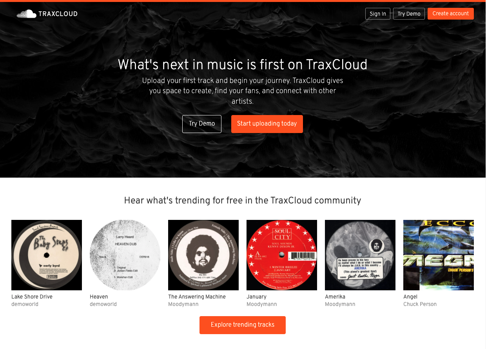
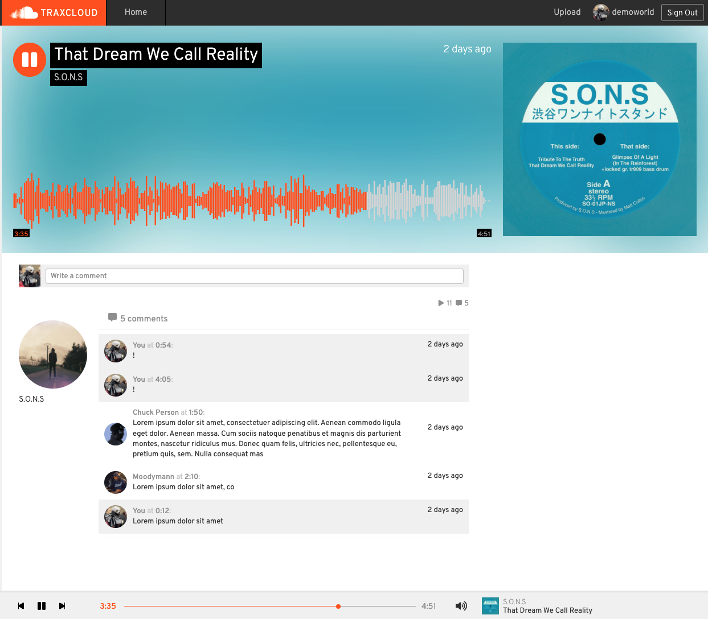

# TraxCloud
[TraxCloud](https://traxcloud.herokuapp.com/), is a rendition of the music streaming platform SoundCloud, that allows users to share and listen to music. It is a full-stack application with a client composed in React / Redux, a REST API built in Node.js and Express, and a relational database managed in PostgreSQL.



## Live Site
[TraxCloud](https://traxcloud.herokuapp.com/)

## Technologies
- React
- Redux
- Node.js
- Express
- PostgreSQL
- Sequelize
- AWS S3
- wavesurfer.js

## Get Started
**Prerequisites**
- NPM
- Node.js >= 14
- PostgreSQL 
- An AWS S3 bucket

**Installation**
- Clone the repo: `git@github.com:minuminukim/traxcloud.git`
- In `/backend` run `npm install`
- .. then once again in `/frontend`
- Create a Postgres database and a user with CREATEDB privileges and a password
- In `/backend` create a .env file and declare your environment variables using `.env.example` as a reference.
        - To generate a secret, use `openssl` in your shell: `openssl rand -base64 10`
- Initialize your database using sequelize-cli: 
    -  `npx dotenv sequelize db:create`
    -  `npx dotenv sequelize db:migrate`
    -  `npx dotenv sequelize db:seed:all`
- Create your AWS user and bucket:
    - Create a bucket: (https://s3.console.aws.amazon.com/s3/home?region=us-east-1)
    - Navigate to ( https://console.aws.amazon.com/iam/home?#/users) to create a user with `Programmatic access`.
    - Set up a security policy for your user: 'Attach existing policies directly' => 'Create Policy'
    - Click the `JSON` tab and set a policy:
 ```
 {
  "Version": "2012-10-17",
  "Statement": [
    {
      "Sid": "Stmt1420751757000",
      "Effect": "Allow",
      "Action": ["s3:*"],
      "Resource": "arn:aws:s3:::<NAME OF BUCKET>/*"
    }
  ]
}
```
- Update your .env with your `Access Key ID`, `Secret Access Key`, and the name of your bucket
- Finally, fire up your servers: run `npm start` in `/backend` and once again in `/frontend`

## Implementation
**Player state**

To implement continuous playback, player state was centralized in Redux with two slices of state: one that manages player state, another that manages queue state.

```
const initialPlayerState = {
  currentTrackId: null,
  currentTime: 0,
  seekPosition: 0,
  seekTime: 0,
  isPlaying: false,
  isMuted: false,
  volume: 1,
};
```
`<GlobalPlayer />` lives outside of the main component hierarchy, which contains an instance of an `<audio>` HTML element. Subscribed to the store, the audio interface is controlled in a series of effects as playback actions get dispatched throughout the application.

Updates to the application's current time are made on play, pause, and seek events as well as whenever the location object updates. Timers that indicate a track's progress are updated by leveraging component state and a `setInterval` call.

## Features
- User registration and JWT authentication
- Song and image upload with AWS S3 integration
- Audio player with continuous playback
- Waveform visualization
- Comments



## Future Goals
- Define React PropTypes
- Waveform scrub event
- Map comments to timeline
- Player shuffle and repeat
- Allow users to view and set their own queues


     
